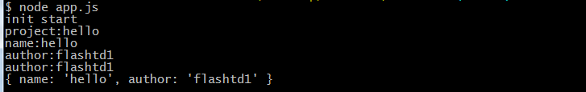

# readline
## Download
```
git clone {git_url}
```

## install
```
npm install
```

## config
* Read `test.js` in `flows` and create your own flow config
### example
```js
// save as a js file in flows folder to use
// your filename is your flow name
'use strict'
const flow = [
    {
        type:'output', // output type just for command output
        tip: 'init start', // your output string in command output
        exec: (preResult) => {
            return new Promise(resolve => {
                // do something you want
                resolve(preResult)
            })
        }
    },
    {
        type: 'handle', // handle type for interaction
        tip: 'project name:', // your tip output for user
        // preResult is your last step's result, 
        // input is users' input for this step
        exec: (preResult, input) => { 
            return new Promise(resolve => {
                preResult.projectName = input
                resolve(preResult)
            })
        }
    },
    ...
]

// read more detail in flows/test.js 

module.exports = flow
```

## use
* Call your flow in node like follow
```
'use strict'
const FH = require('./tools/flow_helper')
FH.start('test').then((finalResult) => {
    console.log(finalResult)
})
```

## command line result
